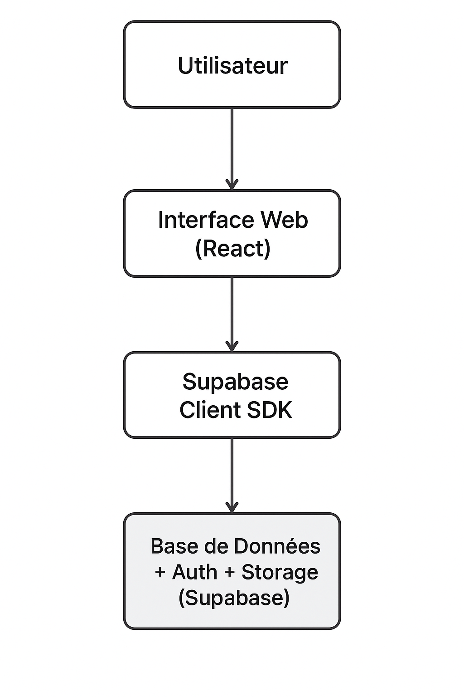

# Conception

## Architecture

L’architecture du système repose sur une approche **client-serveur moderne**.  
Le projet se compose principalement d’une **application web** (frontend) qui interagit directement avec un service backend fourni par **Supabase**.

L’application est structurée selon une logique **modulaire** :

- **Frontend (React + Typescript)** : responsable de l’affichage, de la gestion des interactions, de la navigation et de l’état de l’interface.
- **Backend as a Service (Supabase)** : gère l’authentification, la base de données PostgreSQL, les règles d'accès (RLS), le stockage de fichiers, et l'exposition d'API REST automatiques.
- **Communication** via des requêtes sécurisées (PostgREST + Supabase Client SDK).

Cette architecture permet :
- Une séparation claire entre **logique d’interface** et **gestion des données**
- Une **évolutivité** facile du côté frontend
- Une **réduction de la complexité backend**, puisque Supabase fournit les fonctionnalités clés.

Schéma simplifié :

{ width="40%" .center-image  }

## Choix technologiques

| Technologie | Rôle | Justification |
|------------|------|----------------|
| **React** | Framework frontend | Permet un développement rapide, modulaire et maintenable. Large écosystème et standard moderne du web. |
| **TailwindCSS** | Stylisation | Permet de créer des interfaces modernes rapidement, sans styles répétitifs, tout en assurant la cohérence visuelle. |
| **Typescript** | Typage du code | Améliore la fiabilité, réduit les erreurs, facilite la maintenance et la montée en compétence sur le projet. |
| **Supabase** | Backend-as-a-Service | Offre une base PostgreSQL, Auth, Storage ainsi que la gestion des politiques de sécurité (RLS) nativement. Convient à un projet où backend lourd n’est pas nécessaire. |
| **React Router** | Navigation | Gère la navigation entre les pages de manière fluide et adaptée aux applications modernes. |
| **React Icons** | Icônes | Fournit une bibliothèque d’icônes uniforme et cohérente dans toute l’application. |

Ces choix permettent de garantir :

- **Un développement rapide**
- **Une structure prête à évoluer**
- **Une interface cohérente et moderne**
- **Une gestion simple et sécurisée des données utilisateurs**

## Modèles et diagrammes

### Diagramme Entité–Association (E/A)

Le diagramme E/A a été développé via *Visual Paradigm* et décrit la structure des données du système.

> ``

Ce modèle sert de base à la création des tables dans Supabase.

## Prototype

Le prototype des interfaces utilisateur a été réalisé avec **Figma**.  
Il présente :

- La page d’accueil
- Les profils utilisateurs (étudiants, professeurs, admins)
- Les listes d’opportunités / projets
- Les interactions et flows principaux

> Lien vers le prototype :  
**[Prototype Figma — version V1](https://www.figma.com/design/9xVXkp3RpD7k6wMnX9G1dw/Atrium?node-id=0-1&t=yRhJFFsN4Xh13HFI-1)**

Ce prototype permet :

- De tester le parcours utilisateur avant le développement
- D’aligner les choix de design avec les objectifs du projet
- De servir de référence directe lors de l’implémentation frontend
